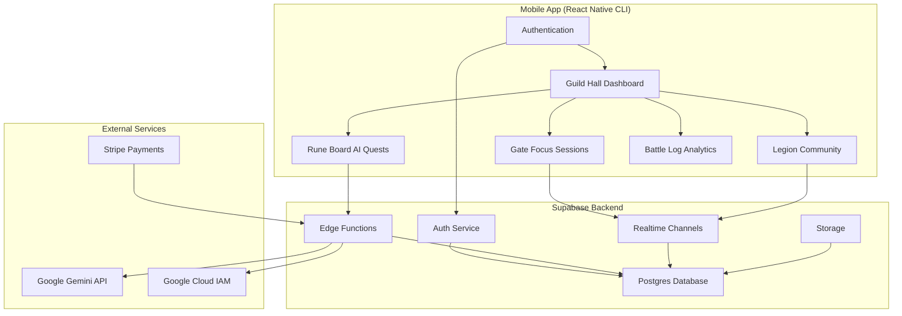

# Design Document

## Overview

The Solo Leveling Productivity App is a React Native mobile application that gamifies productivity through immersive Solo Leveling-themed experiences. The app transforms mundane tasks into epic quests, focus sessions into dungeon raids, and community interaction into guild activities. The architecture prioritizes seamless user experience, invisible API key management, and scalable real-time features.

## Architecture

### High-Level Architecture



### Technology Stack

- **Frontend**: React Native CLI (not Expo) for maximum native control
- **Backend**: Supabase (Postgres, Auth, Realtime, Edge Functions, Storage)
- **AI Service**: Google Gemini with managed API keys
- **Payments**: Stripe via Supabase integration
- **Real-time**: Supabase Realtime channels
- **Styling**: NativeWind (Tailwind for React Native)
- **State Management**: Zustand for client state
- **Navigation**: React Navigation v7

## Components and Interfaces

### Core Components

#### 1. Authentication System
- **AwakeningOnboarding**: Multi-step onboarding flow with class selection
- **ClassSelector**: Interactive class selection (Scholar, Mercenary, Ranger, Shadow Adept)
- **ManaStatePicker**: Mood selection interface (Drained, Focused, Overloaded)

#### 2. Guild Hall Dashboard
- **HunterGreeting**: Personalized welcome with current rank
- **RuneBoard**: AI quest display and interaction
- **EssencePulse**: Real-time anonymized activity feed
- **GatePortal**: Main CTA button for entering focus sessions

#### 3. Gate (Focus Sessions)
- **PortalTimer**: Animated countdown with swirling portal ring
- **ShadowTroop**: Anonymous user avatars in shared sessions
- **AmbientSoundscape**: Audio environment selector and player
- **GateCompletion**: Celebration and reward distribution

#### 4. Legion Community
- **LegionList**: Available public and premium channels
- **LegionChat**: Real-time messaging with Solo Leveling themed UI
- **LegionLeaderboard**: Ranking and achievement display
- **RaidScheduler**: Co-working session planning

#### 5. Battle Log Analytics
- **StreakHeatmap**: Visual representation of activity patterns
- **ProgressChart**: Rank progression and Essence accumulation
- **InsightCards**: Gentle analytics and encouragement

### API Interfaces

#### Edge Functions

```typescript
// getAIPlan - Generate personalized quests
interface GetAIPlanRequest {
  hunterClass: 'Scholar' | 'Mercenary' | 'Ranger' | 'Shadow Adept';
  manaState: 'Drained' | 'Focused' | 'Overloaded';
  previousQuests?: string[];
}

interface GetAIPlanResponse {
  quests: Quest[];
  encouragement: string;
  remainingCredits: number;
}

// createHunterKey - Auto-generate managed API keys
interface CreateHunterKeyRequest {
  userId: string;
  hunterClass: string;
}

// processGateCompletion - Handle focus session rewards
interface GateCompletionRequest {
  sessionDuration: number;
  questsCompleted: string[];
  legionMultiplier?: number;
}
```

## Data Models

### Database Schema

```sql
-- Profiles table (extends Supabase auth.users)
CREATE TABLE profiles (
  id UUID REFERENCES auth.users PRIMARY KEY,
  hunter_name TEXT NOT NULL,
  hunter_class TEXT NOT NULL CHECK (hunter_class IN ('Scholar', 'Mercenary', 'Ranger', 'Shadow Adept')),
  current_rank TEXT DEFAULT 'E-Rank',
  essence_points INTEGER DEFAULT 0,
  streak_count INTEGER DEFAULT 0,
  last_active TIMESTAMP WITH TIME ZONE DEFAULT NOW(),
  
  -- Managed API Key System
  gemini_key_enc TEXT, -- AES-256 encrypted API key
  gemini_budget_cents INTEGER DEFAULT 0,
  gemini_usage_tokens INTEGER DEFAULT 0,
  daily_quest_credits INTEGER DEFAULT 5,
  
  -- Subscription
  subscription_tier TEXT DEFAULT 'free' CHECK (subscription_tier IN ('free', 's_rank')),
  stripe_customer_id TEXT,
  
  created_at TIMESTAMP WITH TIME ZONE DEFAULT NOW(),
  updated_at TIMESTAMP WITH TIME ZONE DEFAULT NOW()
);

-- Quests table
CREATE TABLE quests (
  id UUID DEFAULT gen_random_uuid() PRIMARY KEY,
  hunter_id UUID REFERENCES profiles(id),
  title TEXT NOT NULL,
  description TEXT,
  quest_type TEXT NOT NULL,
  difficulty TEXT NOT NULL,
  essence_reward INTEGER DEFAULT 10,
  completed_at TIMESTAMP WITH TIME ZONE,
  created_at TIMESTAMP WITH TIME ZONE DEFAULT NOW()
);

-- Gates (focus sessions) table
CREATE TABLE gates (
  id UUID DEFAULT gen_random_uuid() PRIMARY KEY,
  hunter_id UUID REFERENCES profiles(id),
  duration_minutes INTEGER NOT NULL,
  soundscape TEXT,
  essence_earned INTEGER DEFAULT 0,
  legion_id UUID REFERENCES legions(id),
  completed_at TIMESTAMP WITH TIME ZONE,
  created_at TIMESTAMP WITH TIME ZONE DEFAULT NOW()
);

-- Legions (communities) table
CREATE TABLE legions (
  id UUID DEFAULT gen_random_uuid() PRIMARY KEY,
  name TEXT NOT NULL,
  description TEXT,
  is_premium BOOLEAN DEFAULT FALSE,
  member_count INTEGER DEFAULT 0,
  created_at TIMESTAMP WITH TIME ZONE DEFAULT NOW()
);

-- Legion memberships
CREATE TABLE legion_members (
  legion_id UUID REFERENCES legions(id),
  hunter_id UUID REFERENCES profiles(id),
  joined_at TIMESTAMP WITH TIME ZONE DEFAULT NOW(),
  PRIMARY KEY (legion_id, hunter_id)
);

-- Usage logs for API key management
CREATE TABLE usage_logs (
  id UUID DEFAULT gen_random_uuid() PRIMARY KEY,
  hunter_id UUID REFERENCES profiles(id),
  tokens_used INTEGER NOT NULL,
  cost_cents INTEGER NOT NULL,
  service_type TEXT DEFAULT 'gemini',
  logged_at TIMESTAMP WITH TIME ZONE DEFAULT NOW()
);

-- Artifacts (cosmetic rewards)
CREATE TABLE artifacts (
  id UUID DEFAULT gen_random_uuid() PRIMARY KEY,
  name TEXT NOT NULL,
  type TEXT NOT NULL CHECK (type IN ('avatar_frame', 'portal_skin', 'emoji_relic')),
  rarity TEXT NOT NULL CHECK (rarity IN ('common', 'rare', 'epic', 'legendary')),
  unlock_requirement TEXT,
  created_at TIMESTAMP WITH TIME ZONE DEFAULT NOW()
);

-- Hunter artifacts (owned cosmetics)
CREATE TABLE hunter_artifacts (
  hunter_id UUID REFERENCES profiles(id),
  artifact_id UUID REFERENCES artifacts(id),
  equipped BOOLEAN DEFAULT FALSE,
  unlocked_at TIMESTAMP WITH TIME ZONE DEFAULT NOW(),
  PRIMARY KEY (hunter_id, artifact_id)
);
```

### Real-time Data Models

```typescript
// Realtime channel payloads
interface EssencePulseEvent {
  type: 'gate_completed' | 'quest_completed' | 'rank_up';
  hunterName: string; // Anonymized
  essence: number;
  timestamp: string;
}

interface GatePresence {
  hunterId: string;
  hunterName: string;
  avatar: string;
  joinedAt: string;
}

interface LegionMessage {
  id: string;
  hunterId: string;
  hunterName: string;
  message: string;
  timestamp: string;
  type: 'message' | 'system' | 'celebration';
}
```

## Error Handling

### API Key Management Errors
- **Budget Exhausted**: Display "Recharge via S-Rank Pass" instead of technical errors
- **Key Rotation Failure**: Graceful fallback to system-wide backup keys
- **Service Unavailable**: Queue requests and retry with exponential backoff

### Real-time Connection Errors
- **Connection Lost**: Show "Shadows are regrouping..." with auto-reconnect
- **Message Delivery Failed**: Local storage backup with sync on reconnect
- **Presence Updates**: Graceful degradation without blocking core functionality

### Payment Processing Errors
- **Subscription Failure**: Maintain current tier access for 48 hours grace period
- **Webhook Delays**: Implement idempotent processing with duplicate detection
- **Refund Processing**: Automated tier downgrade with data retention

### User Experience Errors
- **Quest Generation Failed**: Fallback to curated quest templates
- **Gate Timer Issues**: Local timer backup with server sync validation
- **Analytics Unavailable**: Show encouraging placeholder messages

## Testing Strategy

### Unit Testing
- **API Key Management**: Mock Google Cloud IAM and test encryption/decryption
- **Quest Generation**: Test AI prompt engineering and response parsing
- **Gamification Logic**: Verify Essence calculations and rank progression
- **Payment Processing**: Mock Stripe webhooks and subscription state changes

### Integration Testing
- **Supabase Functions**: Test Edge Function deployment and database interactions
- **Real-time Features**: Validate channel subscriptions and message delivery
- **Authentication Flow**: End-to-end onboarding and class selection
- **Cross-platform**: iOS and Android specific functionality

### Performance Testing
- **Real-time Scalability**: Load test Legion chat and Gate presence
- **API Key Budget Tracking**: Stress test concurrent usage calculations
- **Database Queries**: Optimize leaderboard and analytics queries
- **Mobile Performance**: Memory usage and battery optimization

### Security Testing
- **API Key Encryption**: Validate AES-256 implementation and key rotation
- **User Data Protection**: Test Row Level Security policies
- **Payment Security**: PCI compliance validation through Stripe
- **Rate Limiting**: Prevent abuse of AI quest generation

### User Acceptance Testing
- **Onboarding Flow**: Validate class selection and initial experience
- **Core Gameplay Loop**: Test quest → gate → reward → repeat cycle
- **Community Features**: Legion interaction and social elements
- **Subscription Experience**: Free tier limits and premium upgrade flow

## Implementation Phases

### Phase 1: Foundation (MVP Core)
- React Native CLI project setup with NativeWind
- Supabase integration and basic authentication
- Profile creation with class selection
- Basic Gate timer functionality

### Phase 2: AI Integration
- Google Cloud IAM service account setup
- Managed API key creation and encryption
- AI quest generation with Gemini integration
- Usage tracking and budget management

### Phase 3: Gamification
- Essence point system and rank progression
- Artifact system and cosmetic rewards
- Streak tracking without punishment mechanics
- Battle Log analytics dashboard

### Phase 4: Community Features
- Legion creation and membership
- Real-time chat with Supabase channels
- Legion Raids and co-working sessions
- Leaderboards and social features

### Phase 5: Premium Features
- Stripe integration and subscription management
- S-Rank Pass premium features
- Advanced analytics and insights
- BYOK (Bring Your Own Key) functionality

### Phase 6: Polish and Optimization
- Performance optimization and caching
- Advanced error handling and offline support
- Push notifications and background sync
- App store deployment and CI/CD pipeline